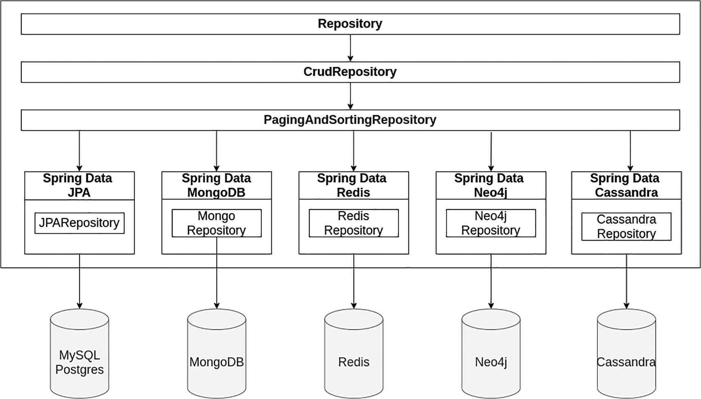

# Introduction to Spring Data

Spring Data is subproject of Spring Framework that provides an easy and consistent way to access data from various data stores and databases. It reduces boilerplate code needed, provides a high-level, standardized object-oriented abstraction layer on top of different data stores. Spring Data provides convenient ways to perform common database operations, as well as querying the database using both derived and custom queries. Developers can write database queries using familiar object-oriented syntax, allows to focus on their application logic rather than low-level data access concerns.

Spring Data supports a wide range of data stores, including traditional relational databases, non-relational databases such as MongoDB, Redis, and Cassandra, and cloud-based data services such as AWS DynamoDB and Google Cloud Firestore. It provides a variety of modules of data access, including `Spring Data JDBC`, `Spring Data JPA`, `Spring Data MongoDB`, `Spring Data Redis`, and many others, each tailored to the specific data store. This makes it easy for developers to switch between different data stores without having to change the application code. Additionally, Spring Data provides features such as transaction management, auditing, and query optimization, making it a popular choice for enterprise applications.

> This series is based on Andres Sacco book, [Beginning Spring Data: Data Access and Persistence for Spring Framework 6 and Boot 3](https://learning.oreilly.com/library/view/beginning-spring-data/9781484287644/)

## Spring Data JPA

JPA (Java Persistence API) is a specification that defines a standard way of mapping Java objects to relational databases. JPA provides a set of annotations that allow developers to map Java classes to database tables and columns, including annotations to:
- specify primary key
- specify relationships between entities
- specify various fetch and cascade options
- performing CRUD (create, read, update, delete) operations on entities
- querying the database using JPQL (Java Persistence Query Language)

`Spring Data JPA` is a module of the Spring Data project that provides a high-level, object-relational mapping (ORM) abstraction over the JPA. With `Spring Data JPA`, developers can write repository interfaces that extend the `JpaRepository` interface, which provides a set of CRUD (create, read, update, delete) operations for working with entities. `Spring Data JPA` also supports the use of query methods, which allows developers to define query methods using a naming convention, without having to write SQL or JPQL queries. More details explanation in [5. Queries](05-queries.md).

_Spring Data Supported Database_

### Object Mapping

Object mapping is a key feature of Spring Data, as it provides a way for developers to work with data in an object-oriented way, rather than having to deal with low-level database-specific details. Spring Data dynamically creates a lot of classes in runtime to transform the interface into classes. Think of this approach as a proxy, using the interface instead of the classes that access the database. Spring Data offers make it possible to map a table with a particular class considering all the possible types of columns and the relationship between tables. 

### Repositories

At a high level, the architecture of Spring Data follows the "Repository" pattern, which is a common pattern for data access in Java applications. The Repository interface provides a central abstraction for data access operations and can be extended to define custom data access methods. Spring Data provides implementations for the Repository interface that use JPA, Hibernate, MongoDB, and other data stores.

Repository pattern is a design pattern used in software engineering to decouple the application layer from the persistence layer of a software application. It provides an abstraction layer between the application code and the data access layer, which makes the application more maintainable, testable, and scalable.

In this pattern, the application interacts with the data source through a repository, which acts as a mediator between the application and the data access layer. The repository provides a standard set of methods for performing CRUD (Create, Read, Update, Delete) operations on the data source. These methods are typically defined as interfaces, which allows the application to work with any data source, whether it's a database, a web service, or an in-memory collection.

By using the Repository pattern, the application code becomes more modular, easier to test, and less dependent on the underlying data access technology. It also makes it easier to switch between different data access technologies or to introduce new ones, without having to change the application code.
