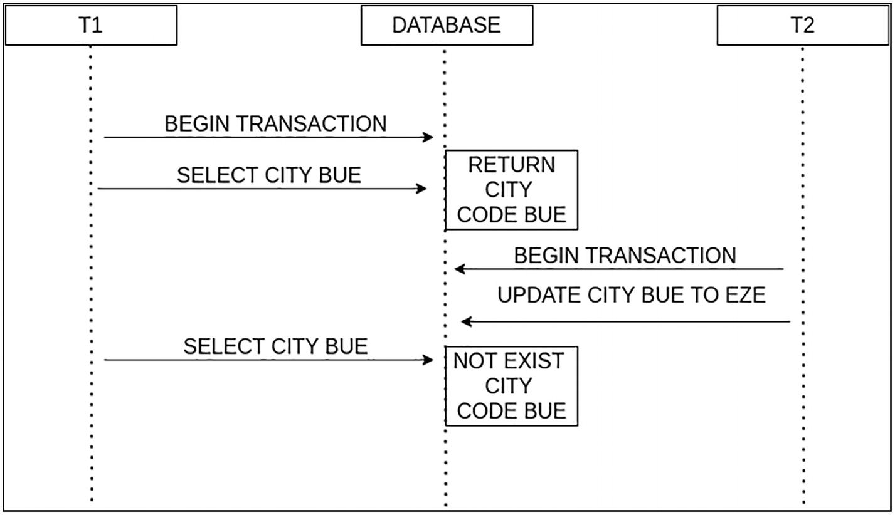

# Transaction

## Contents:

- [What is Transaction?](#what-is-transaction)
- [Isolation](#isolation)
- [Transaction in Spring Data](#transaction-in-spring-data)

## What is Transaction?

Transaction is a set of write and read operations grouped for criteria that need to be executed to ensure that all operations are executed or not one of them.

> A transaction in a database starts with the `BEGIN_TRANSACTION` keyword and needs to indicate that all the operations
> end successfully using the `COMMIT` keyword. So, the database takes this instruction and ensures this is the new state
> for the affected rows. On the other hand, when operations fail, you need to invoke the `ROLLBACK` keyword to indicate
> that the database needs to back to the previous state before all the operations are executed. Example in Postgresql:
>
> ```
> BEGIN;
> 
> UPDATE accounts
>   SET balance = balance - 1000
> WHERE account_no = 100;
> 
> UPDATE accounts
>   SET balance = balance + 1000
> WHERE account_no = 200;
> 
> COMMIT;
> ```

Next, we will go through some topic related to transaction to give more understanding of how this concept works.

## Isolation

It is refers to the possibility that two or more operations try to modify the same information at the same moment. The database needs to guarantee that the information only is visible to other people when all the operations of the transactions finish okay. Each database must provide a mechanism to solve or mitigate this problem. There is a locking mechanism to solve the problems of concurrency in the databases, as discussed later in this chapter.

### Isolation Problem - Lost Update

Imagine that two simultaneous transactions try to modify the same row in a table that contains the code of a particular city in the catalog API. The last commit in the database wins but may not be the correct one.


### Isolation Problem - Dirty Read

Occurs when two or more transactions simultaneously obtain or use the information in a database before the changes of another transaction are committed. So the transactions use information that may not exist.

Imagine that you update an attribute in the countries in your catalog to use a particular currency inserted in another transaction. If the transaction that inserts the new currency fails, you have an inconsistency in your database because most countries will have a currency that does not exist. If someone selects a country before the transaction is committed or rolled back, they could potentially use incorrect information


### Isolation Problem - Unrepeatable Read

Happens when one transaction obtains certain information, but when trying to obtain the same information again, another transaction modifies the information.



### Isolation Problem - Phantom Read

Happens when you execute an operation two or more times in one table, and the second time you obtain values than in the previous one because one transaction commits all the changes.


### Isolation Level

|                     | Lost updates | Dirty reads  | Non-repeatable reads | Phantom reads |
|---------------------|--------------|--------------|----------------------|---------------|
| **Read uncommitted** | Not possible | Possible     | Possible             | Possible      |
| **Read committed**  | Not possible | Not possible | Possible             | Possible      |
| **Repeatable read** | Not possible | Not possible | Not possible         | Possible      |
| Serializable        | Not possible | Not possible | Not possible         | Not possible  |

**Serializable**

- The highest isolation level that provides complete isolation between transactions.
- Ensures that transactions execute as if they were executed serially, one after the other, even if they are executed concurrently.
- Achieves this by placing a read/write lock on all data accessed by a transaction until it is committed
- Has the highest performance overhead and can lead to lower concurrency and throughput due to its strict locking requirements.
- Should be used only when the data being accessed is highly sensitive or critical, and when it is acceptable to sacrifice some performance in order to maintain the integrity of the data.

**Repeatable read**

- Ensures that a transaction sees a consistent snapshot of the data it is accessing, even if other transactions are modifying that data concurrently.
- Achieves this by placing a read lock on all data accessed by a transaction until it is committed, preventing other transactions from modifying that data until the first transaction is done.
- Suitable for scenarios where dirty reads are not acceptable, but a higher level of concurrency and throughput is desired

**Read committed**

- Ensures that a transaction sees only committed data, preventing dirty reads.
- Allows for non-repeatable reads and phantom reads, because other transactions can modify or insert data concurrently.
- Achieves this by placing a read lock on all data accessed by a transaction, but releasing the lock as soon as the data is read, allowing other transactions to access and modify that data.
- This can lead to increased concurrency, but can also lead to data inconsistencies if multiple transactions modify the same data concurrently.
- Typically used in applications where the risk of data inconsistencies is low, and where high concurrency is important.

**Read uncommitted**

- Allows a transaction to read uncommitted changes made by other transactions, allowing for dirty reads.
- Allows for non-repeatable reads and phantom reads, because other transactions can modify or insert data concurrently.
- Achieves this by not placing any locks on the data accessed by a transaction, allowing other transactions to modify or insert data concurrently.
- Typically used in applications where high concurrency is important and where the risk of data inconsistencies is low.
- Rarely used in practice, except in special cases where the risk of data inconsistencies can be mitigated.

## Transaction in Spring Data

Spring 3.1 introduces the `@EnableTransactionManagement` annotation that we can use in a `@Configuration` class to enable transactional support. However, if we're using a Spring Boot project and have a `spring-data-*` or `spring-tx`dependencies on the classpath, then transaction management will be enabled by default.

`@Transactional` is an important annotation that you can use in a method, class, or interface which creates a proxy class that has the responsibility to create the transaction and commit/roll back all the operations inside the transaction. This annotation is connected directly with Spring TX (org.springframework.transaction.annotation.Transactional), which is not the same as JEE. This annotation only works for the public methods because it’s a constraint of the proxy classes of Spring Framework , so if you put the annotation in the private/protected Spring Framework, you ignore them without showing any error on the console or in your IDE.

At a high level, Spring creates proxies for all the classes annotated with @Transactional, either on the class or on any of the methods. The proxy allows the framework to inject transactional logic before and after the running method, mainly for starting and committing the transaction.

### `@Transactional` Properties

We can annotate a bean with `@Transactional` at the interface, class or method level. The annotation support further configuration using properties as well. See the documentation [here](https://docs.spring.io/spring-framework/docs/current/javadoc-api/org/springframework/transaction/annotation/Transactional.html). More details explanation [here](https://www.baeldung.com/transaction-configuration-with-jpa-and-spring).

- `isolation`: ensures that each transaction operates independently and in isolation from other transactions, even if they are executing concurrently. This means that a transaction's changes to the database are not visible to other transactions until the transaction is committed. The level of isolation can be controlled through the use of isolation levels, which determine how data modifications made by one transaction affect other transactions. Available isolation level:
    - `Isolation.DEFAULT`: Read Committed is the default isolation level in Postgresql.
    - `Isolation.SERIALIZABLE`
    - `Isolation.READ_UNCOMMITTED`
    - `Isolation.READ_COMMITTED`
    - `Isolation.REPEATABLE_READ`
- `readOnly`: `Boolean`. If the transaction is read-only, the framework and the database introduce optimizations to this type of operation. The main problem with the incorrect use of this property appears when you use it in methods that write modifications in the database. It does not persist, and the modifications are lost. More use case of this properties can be read [here](https://vladmihalcea.com/read-write-read-only-transaction-routing-spring/).
- `rollbackFor`: `Class<? extends Throwable>[]`. If no custom rollback rules are configured in this annotation, the transaction will roll back on `RuntimeException` and `Error` but not on checked exceptions. You also can skip an exception using `noRollbackFor`.
- `timeOut`: Timeout is expressed in milliseconds (`int`)
- `propagation`: "Propagation" in Spring Data refers to the behavior of transactions when multiple transactions are involved in a single operation. Available options:
    - `REQUIRED`: if a transaction is already active, the annotated method will execute within that transaction. If no transaction is active, a new transaction will be started.
    - `SUPPORTS`: the annotated method will execute within an existing transaction, if one exists. If no transaction is active, the method will be executed without a transaction.
    - `MANDATORY`: the annotated method must execute within an existing transaction. If no transaction is active, a "TransactionRequiredException" will be thrown.
    - `REQUIRES_NEW`: when a transaction is in progress, it pauses it, and a new one starts; but if there is no transaction in progress, it creates a new one.
    - `NOT_SUPPORTED`: variant of the previous scenario because if a transaction is in progress, it pauses, and all the transactional methods are executed without a transaction.
    - `NEVER`: if a transaction is running when a method with this property, IllegalTransactionStateException is thrown.
    - `NESTED`: when `Propagation.NESTED` is used, a nested transaction is created whenever a transaction is already active. The nested transaction will have its own separate transaction context, and any changes made within the nested transaction will be committed or rolled back independently of the outer transaction. If the nested transaction completes successfully, it will be committed and the changes made within it will become a permanent part of the outer transaction. If the nested transaction fails and is rolled back, the outer transaction will remain intact and the changes made within the nested transaction will be discarded. If there is no existing transaction when the method annotated with "Propagation.NESTED" is called, a new transaction will be started, just like with "Propagation.REQUIRED". It is important to note that not all database systems support nested transactions, so the exact behavior of "Propagation.NESTED" may depend on the underlying database technology.

> Further reads:
> - https://www.marcobehler.com/guides/spring-transaction-management-transactional-in-depth
> - https://www.baeldung.com/transaction-configuration-with-jpa-and-spring
