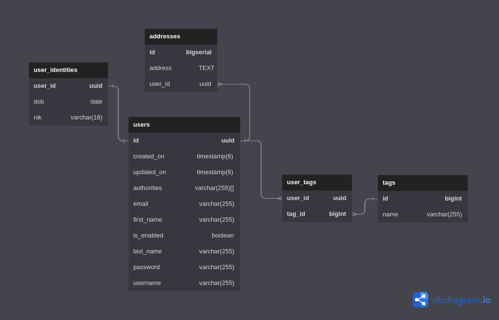

# Belajar Spring Data

File ini berisi langkah-langkah praktis untuk memulai dari project dari nol.
Penjelasan mengenai tutorial ini bisa dilihat di dalam folder `learning_sources`.

## Daftar Isi
 
- [Project Setup](#project-setup)
- [Setup `application.yml`](#setup-applicationyml)
- [ERD](#erd)
- [Entities](#entities)
- [Repositories](#repositories)
- [DTOs](#dtos)

## Project Setup

Di bawah ini adalah setup yang digunakan:

- Java 17
- Spring Boot 3.0.1
- Maven
- Packaging: JAR

**Dependencies:**

- Spring Web
- Spring Data JPA
- PostgreSQL Driver
- Lombok
- Spring Configuration Processor
- Flyway Migration

Atau klik [tautan](https://start.spring.io/#!type=maven-project&language=java&platformVersion=3.0.1&packaging=jar&jvmVersion=17&groupId=com.azkafadhli&artifactId=belajarspringdata&name=belajarspringdata&description=Alterra%20Academy%20-%20Belajar%20Spring%20Data&packageName=com.azkafadhli.belajarspringdata&dependencies=web,data-jpa,postgresql,lombok,configuration-processor,flyway) ini untuk membuat setup yang sama.

## Setup `application.yml`

Ubah file `application.properties` menjadi `application.yml`.

> Lihat [di sini](https://www.baeldung.com/spring-boot-yaml-vs-properties) untuk mengetahui perbandingan kedua tipe tersebut.

Berikut setup yang diperlukan untuk melakukan koneksi ke database.

```yaml
spring:
  datasource:
    url: "jdbc:postgresql://localhost:5432/belajar_spring_data"
    username: postgres
    password: 1234567890
    driver-class-name: org.postgresql.Driver
  jpa:
    hibernate:
      ddl-auto: create
    show-sql: true
    generate-ddl: true
    properties:
      database: postgresql
      database-platform: org.hibernate.dialect.PostgreSQLDialect
```

Kita menggunakan `ddl-auto: create`.
Setiap kali aplikasi dijalankan akan menghapus skema lama jika sudah ada dan dibuat skema baru.
Pilihan lainnya:

- `validate`: tidak membuat skema baru, hanya memvalidasi apakah skema sudah sesuai dengan konfigursi
- `update`: update skema
- `create`:  ketika dijalankan akan menghapus skema lama, membuat skema baru
- `create-drop`: menghapus skema setiap kali aplikasi dihentikan, dan akan membuat skema baru jika aplikasi dijalankan

Pastikan database PostgreSQL sudah dijalankan, Lalu coba jalankan aplikasi untuk memastikan tidak ada error.
Pada bagian selanjutnya, kita akan membuat entity.

## ERD



## Entities

Buat sebuah package bernama `entities`. Di dalamnya buat lima kelas baru bernama `User`, `Address`, `Tag`, `Audit`, `UserIdentity`, dan enum `Authority`. Penjelasan mengenai pembuatan entity bisa dilihat di bagian [learning_sources/02-entities.md](learning_sources/02-entities.md).

`User`
```java
@Entity
@Table(name = "users")
@Builder
@NoArgsConstructor
@Data
public class User {

    @Id
    @GeneratedValue(strategy = GenerationType.UUID)
    private String id;

    private String firstName;

    private String lastName;

    // email & name will be mapped to column with same name
    // if no name set in annotation @Column
    @Column(unique = true, nullable = false)
    @NotBlank(message = "Email is mandatory")
    private String email;

    @Column(unique = true, nullable = false)
    @NotBlank(message = "Username is mandatory")
    private String username;

    @Column(nullable = false)
    @NotBlank(message = "Password is mandatory")
    private String password;

    @Column(columnDefinition = "boolean default false")
    private Boolean isEnabled;

    @ManyToMany(fetch = FetchType.LAZY)
    @JoinTable(
            name = "user_tags",
            joinColumns = {@JoinColumn(name = "user_id")},
            inverseJoinColumns = {@JoinColumn(name = "tag_id")}
    )
    private Set<Tag> tags;

    @OneToMany(fetch = FetchType.LAZY, mappedBy = "user")
    private List<Address> addresses;

    @Enumerated(EnumType.STRING)
    private Set<Authority> authorities;

    @OneToOne(mappedBy = "user", fetch = FetchType.LAZY)
    @PrimaryKeyJoinColumn
    private UserIdentity userIdentity;

    @Embedded
    private Audit audit;

    @PrePersist
    public void fillCreatedOn() {
        audit.setCreatedOn(LocalDateTime.now());
    }

    @PreUpdate
    public void fillUpdatedOn() {
        audit.setUpdatedOn(LocalDateTime.now());
    }

}
```

[//]: # (TODO: enable soft delete in `User` entity)

`Address`
```java
@Entity
@Table(name = "addresses")
@Builder
@NoArgsConstructor
@AllArgsConstructor
@Data
public class Address {
    
    @Id
    @GeneratedValue(strategy = GenerationType.IDENTITY)
    private Long id;

    @Column(columnDefinition = "TEXT")
    private String address;

    @ManyToOne
    @JoinColumn(name = "user_id", nullable = false)
    @JsonIgnore
    private User user;
    
}
```

[//]: # (TODO: enable soft delete in `Address` entity)

`Tag`
```java
@Entity
@Table(name = "tags")
@Builder
@NoArgsConstructor
@AllArgsConstructor
@Data
public class Tag {

    @Id
    @GeneratedValue(strategy = GenerationType.SEQUENCE)
    private Long id;

    private String name;

    @ManyToMany(mappedBy = "tags")
    @JsonIgnore
    private List<User> users;

}
```

[//]: # (TODO: enable soft delete in `Tag` entity)

`Audit`

```java
@Embeddable
@Getter
@Setter
public class Audit {
    
    @Column(name = "created_on", nullable = false)
    private LocalDateTime createdOn;
    
    @Column(name = "updated_on")
    private LocalDateTime updatedOn;
    
}
```

`UserIdentity`

```java
@Entity
@Table(name = "user_identities")
@Builder
@NoArgsConstructor
@AllArgsConstructor
@Data
public class UserIdentity {

    @Id
    @Column(name = "user_id")
    private UUID id;

    @OneToOne
    @MapsId
    @JoinColumn(name = "user_id")
    private User user;

    @Column(length = 16)
    private String nik;

    private Date dob;

}
```

`Authority`

```java
public enum Authority {
    READ, WRITE, UPDATE, DELETE
}
```

Setelah entity dibuat, restart aplikasi dan lihatlah perubahan di database. Jika tidak ada error, table secara otomatis terbuat.


## Repositories

Berikutnya, kita membuat sebuah interface repository untuk mengakses tabel dan melakukan query.
Buatlah sebuah package bernama `repositories`, lalu di dalamnya buat interface `IUserRepository`, `IAddressRepository`, `ITagRepository`, dan `IUserIdentity`.

`IUserRepository`

```java
public interface IUserRepository extends JpaRepository<User, UUID> {
}
```

`IAddressRepository`

```java
public interface IAddressRepository extends JpaRepository<Address, Long> {
}
```

`ITagRepository`

```java
public interface ITagRepository extends JpaRepository<Tag, Long> {
}
```

`IUserIdentity`

```java
public interface IUserIdentity extends JpaRepository<UserIdentity, UUID> {
}
```

## Services

Langkah selanjutnya adalah membuat service yang menggunakan repository.
Buat sebuah package bernama `Services`, lalu di dalamnya buat sebuah interface `IUserService` dan kelas yang mengimplementasikannya `UserService`.

`IUserService`
```java
public interface IUserService {
}
```

`UserService`
```java
public class UserService implements IUserService {
}
```

## DTOs

`DTO`: Data Transfer Object. A class whose purpose is to transfer data, usually from server to client (or vice versa).

### Why DTO?

For more details explanation, see [here](https://www.baeldung.com/java-dto-pattern#when-to-use-it).

### `BaseResponse`
```java
@JsonInclude(JsonInclude.Include.NON_NULL)
public class BaseResponse <T> {
    private final int code;

    private final String message;

    private final T data;

    private Pagination pagination;

    public BaseResponse(int code, String message, T data) {
        this.code = code;
        this.message = message;
        this.data = data;
    }

    public BaseResponse(int code, String message, T data, Pagination pagination) {
        this.code = code;
        this.message = message;
        this.data = data;
        this.pagination = pagination;
    }
}
```

### `SuccessResponse`

### `CreateUserRequest`
```java
@Getter
@Setter
public class CreateUserRequest implements Serializable {

    @JsonProperty(required = true)
    private String firstName;

    @JsonProperty(required = true)
    private String lastName;

    @JsonProperty(required = true)
    private String email;

    @JsonProperty(required = true)
    private String password;

    @JsonProperty(defaultValue = "false")
    private Boolean isEnabled;

}
```